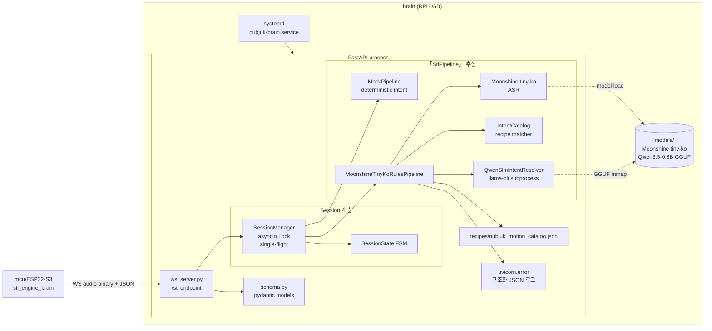
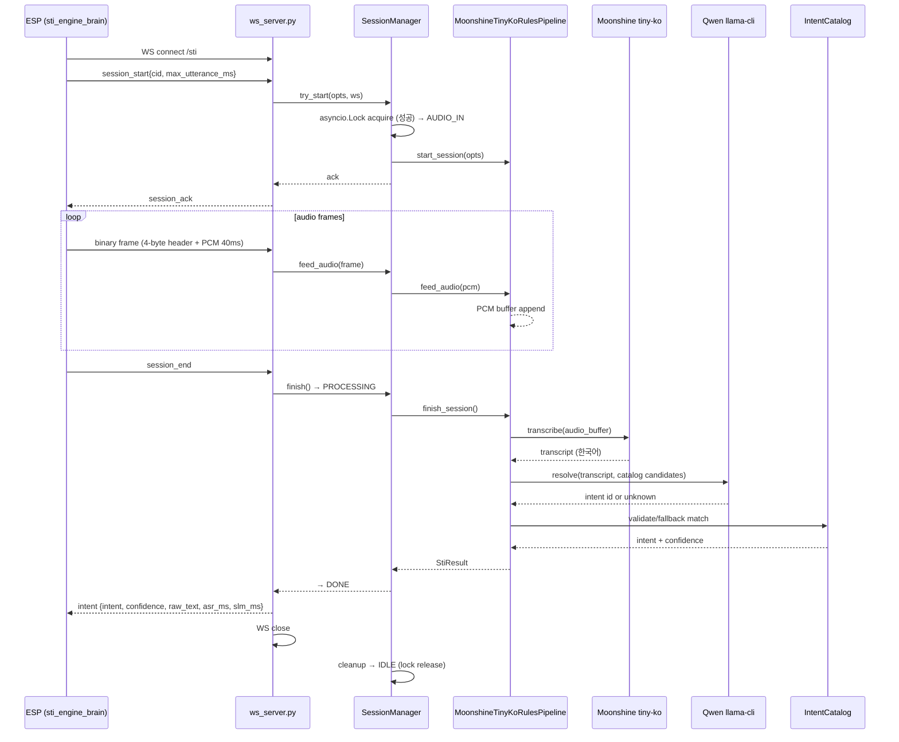
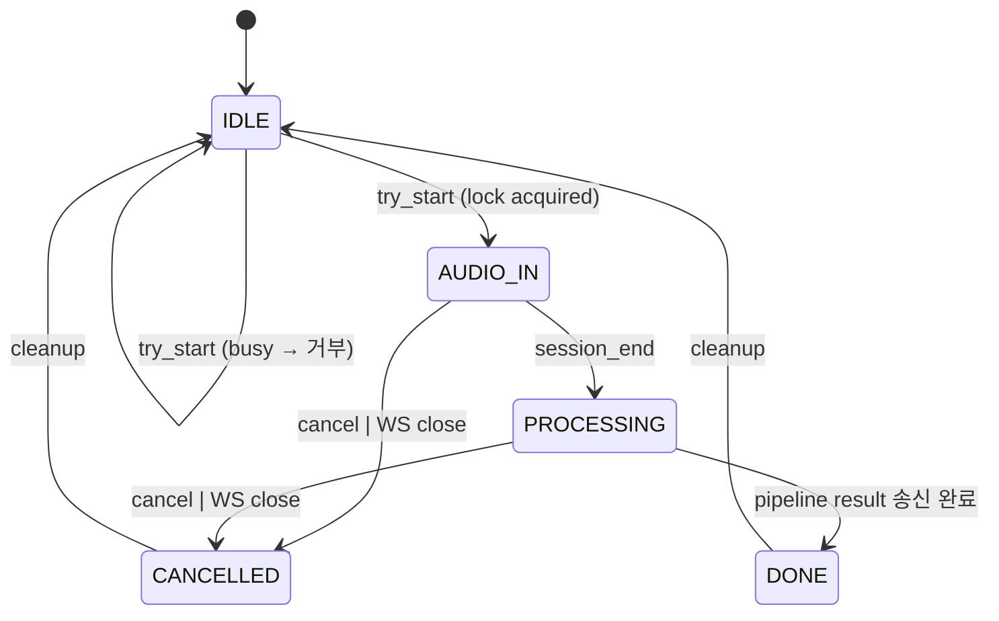

# Brain — 모듈 아키텍처

> ⚠️ **Phase 4부터 활성**. Phase 1~3에는 디렉토리만 존재.

RPi 4GB에서 stateful WS 세션으로 mcu의 `sti_engine_brain` 클라이언트와 통신하는 STI 서비스. 현재 구현은 P1 검증용 `MockPipeline`과 실음성 검증용 `MoonshineTinyKoRulesPipeline`을 함께 둔다. 실음성 경로는 Moonshine tiny-ko ASR, brain-owned recipe catalog, Qwen 3.5 0.8B GGUF SLM resolver를 사용한다.

---

## 컴포넌트 다이어그램



---

## 한 utterance 처리 흐름



---

## SessionState 머신



**Cleanup 보장** (모든 종료 경로 — DONE/CANCELLED/예외):
1. lock release
2. pipeline `cancel_session()` 호출 (idempotent)
3. audio buffer 해제
4. SLM subprocess가 살아있으면 terminate→kill (timeout 1초)

---

## Pipeline 구조

런타임 pipeline은 `BRAIN_PIPELINE`으로 고른다.

| Pipeline | 목적 | 구현 |
|----------|------|------|
| `mock` | MCU happy-path 검증. 오디오 내용은 보지 않고 고정 intent를 반환한다. | `brain/pipeline/mock.py` |
| `moonshine_tiny_ko` | 마이크 음성을 실제로 ASR → SLM/catalog → intent로 변환한다. | `brain/pipeline/moonshine_tiny_ko.py` |

### `moonshine_tiny_ko`

```
audio frames (PCM 16kHz mono)
        │
        ▼
┌─────────────────────────────────┐
│  feed_audio(): PCM buffer 누적   │
│  max_audio_ms 초과 시 timeout     │
└─────────────────────────────────┘
        │
        │ session_end 도착
        ▼
┌─────────────────────────────────┐
│  Moonshine tiny-ko transcribe     │  ASR
│   → 한국어 transcript            │
└─────────────────────────────────┘
        │
        ▼
┌─────────────────────────────────┐
│  Qwen 3.5 0.8B via llama-cli      │  SLM
│  + deterministic catalog fallback │
│   → intent id                    │
└─────────────────────────────────┘
        │
        ▼
┌─────────────────────────────────┐
│  catalog intent 검증 + confidence │
│   → StiResult or StiError       │
└─────────────────────────────────┘
```

### Brain-owned motion recipe catalog

현재 구현은 MCU가 recipe를 업로드하지 않고, brain이 motion recipe catalog를 소유한다. MCU는 WS로 오디오만 보내고, brain은 ASR 결과 텍스트를 catalog에 매칭한 뒤 잠금 protocol의 `intent` 응답으로 motion id를 돌려준다.

파일 역할:

| 파일 | 역할 |
|------|------|
| `recipes/nubjuk_motion_catalog.json` | 배포/실행 시 사용하는 Nubjuk motion recipe catalog. `INTENT_CATALOG_PATH`로 지정한다. |
| `brain/intent/default_catalog.json` | 별도 path가 없을 때 사용하는 package fallback catalog. |
| `brain/intent/catalog.py` | catalog JSON 검증, alias 정규화, intent 매칭을 담당한다. |

현재 `recipes/nubjuk_motion_catalog.json`의 motion set:

| Intent id | 대표 alias | 설명 |
|-----------|------------|------|
| `idle` | `가만히 있어`, `멈춰`, `대기`, `idle` | idle pose 유지 또는 복귀 |
| `sit` | `앉아`, `앉아줘`, `안 자`, `sit` (`asr_noise`: `인자`, `환자`, `아니다`) | sitting pose 진입 |
| `stand` | `일어서`, `일어나`, `stand up`, `stand` | standing pose 진입 |
| `roll_left` | `왼쪽으로`, `좌로 굴러`, `좌로 글로`, `role left` (`asr_noise`: `잘 어울려`, `잘 어글러`) | 왼쪽 구르기 |
| `roll_right` | `오른쪽으로`, `우로 굴러`, `우러글라`, `울어 굴러`, `role right` | 오른쪽 구르기 |
| `give_hand` | `손 줘`, `손 내밀어`, `악수`, `give hand` | 손 내밀기/악수 동작 |
| `surprise` | `어흥`, `왁`, `와악`, `으악`, `까꿍`, `surprise` | 사용자가 Nubjuk을 놀래키는 소리에 대한 startled reaction |

MCU가 실제로 실행하려면 brain이 보내는 intent id가 MCU motion registry에도 등록되어 있어야 한다. 현재 brain catalog는 `give_hand`를 반환할 수 있으므로, MCU registry에 같은 id가 없으면 실행 단계에서 reject될 수 있다.

recipe JSON 형식:

```json
{
  "catalog_version": "nubjuk-motion-2026-05-06.4",
  "intents": [
    {
      "id": "sit",
      "aliases": ["앉아", "앉아라", "앉으세요", "앉아줘", "안 자", "sit"],
      "asr_noise": ["인자", "환자", "아니다"],
      "description": "Move into a sitting pose.",
      "slots": {},
      "confidence": 0.86,
      "exact_confidence": 0.94,
      "phonetic_confidence": 0.72
    }
  ]
}
```

필드 의미:

| 필드 | 의미 |
|------|------|
| `catalog_version` | 로그와 검증에 남기는 catalog 버전. motion set이 바뀌면 증가시킨다. |
| `id` | MCU로 내려가는 최종 motion intent id. 예: `idle`, `sit`, `stand`, `roll_left`, `roll_right`, `give_hand`, `surprise`. |
| `aliases` | 사람이 의도적으로 말할 정상 한국어/영어 표현 목록. exact/partial/phonetic 매칭에 사용한다. |
| `asr_noise` | 검증 중 반복 관찰된 ASR 오인식. exact-only로만 매칭하고 부분 매칭에는 사용하지 않는다. 예: `앉아` 발화가 `인자`, `환자`, `아니다`로 들어온 경우. |
| `description` | 사람이 읽는 설명. 런타임 매칭에는 사용하지 않는다. |
| `slots` | 향후 파라미터형 motion에 사용할 구조화 값. 현재 기본값은 `{}`. |
| `confidence` | 부분 매칭에 사용할 신뢰도. |
| `exact_confidence` | 정규화 후 transcript 전체가 alias와 정확히 같을 때 사용할 신뢰도. |
| `phonetic_confidence` | 한국어 발음 유사도 fallback으로 매칭될 때 사용할 신뢰도. |

매칭 규칙:

1. ASR transcript를 소문자화하고 punctuation을 제거한 뒤 공백을 정리한다.
2. Catalog는 ASR transcript와 alias 사이의 한국어 발음 후보를 계산한다. 후보는 한글 음절을 자모 pronunciation key로 바꾼 뒤 edit distance score로 정렬한다.
3. `BRAIN_SLM_ENABLED=true`이면 Qwen SLM prompt에 raw transcript, 발음 후보, catalog 후보, 검증 중 관찰된 ASR noise example을 함께 넣는다. 예: `우러글라`/`울어 굴러` → `roll_right`, `좌로 글로` → `roll_left`, `너 저기 일어서` → `stand`, `손 줘` → `give_hand`.
4. SLM이 catalog에 존재하는 intent id를 반환하더라도 deterministic catalog match와 다른 intent이면 덮어쓰지 않는다. 같은 intent일 때만 confidence 상승용으로 채택한다.
5. Deterministic match가 `unknown`이면 SLM 단독 intent는 채택하지 않는다. 움직이는 robot에서는 근거 없는 motion보다 `unknown`이 안전하다.
6. SLM이 `unknown`, invalid output, timeout/error를 내면 deterministic catalog matcher로 fallback한다.
7. Deterministic matcher는 공백 제거 형태가 alias와 완전히 같으면 `exact_confidence`를 사용한다.
8. Exact alias가 없고 `asr_noise`와 완전히 같으면 `confidence`를 사용한다. `asr_noise`는 부분 포함 매칭을 하지 않는다.
9. 완전 매칭이 없으면 가장 긴 alias부터 부분 포함 여부를 확인하고 `confidence`를 사용한다.
10. 부분 매칭이 없으면 한국어 음절을 자모로 분해해 alias와 transcript window의 발음 유사도를 비교하고, threshold 이상이면 `phonetic_confidence`를 사용한다. 2음절 이상 alias도 처리한다. 예: `좌로 글로` → `좌로 굴러`, `은자` → `안 자`.
11. 어떤 alias에도 매칭되지 않으면 `intent="unknown"`과 `MOONSHINE_UNKNOWN_CONFIDENCE`를 반환한다.
12. alias/asr_noise는 공백 제거 후 중복될 수 없다. 예를 들어 `앉아 줘`와 `앉아줘`는 같은 alias로 간주한다.

SLM runtime 설정:

| 변수 | 기본값 | 의미 |
|------|--------|------|
| `BRAIN_SLM_ENABLED` | `true` | Moonshine pipeline에서 Qwen SLM intent resolver를 사용할지 여부. |
| `LLAMA_CLI` | `.tools/llama.cpp/bin/llama-cli` | `llama-cli` 실행 파일 경로. |
| `QWEN35_MODEL_PATH` | `models/qwen3.5-0.8b/Qwen3.5-0.8B-Q4_K_M.gguf` | Qwen 3.5 0.8B GGUF 모델 경로. |
| `BRAIN_SLM_TIMEOUT_MS` | `5000` | SLM subprocess timeout. timeout 시 fallback matcher를 사용한다. |
| `BRAIN_SLM_CONFIDENCE` | `0.78` | SLM이 valid intent id를 반환했을 때의 신뢰도. |
| `BRAIN_SLM_MAX_TOKENS` | `16` | SLM이 생성할 최대 token 수. |
| `BRAIN_SLM_CONTEXT_SIZE` | `2048` | SLM prompt context 크기. |

ASR runtime 설정:

| 변수 | 기본값 | 의미 |
|------|--------|------|
| `BRAIN_PIPELINE` | `mock` | `mock` 또는 `moonshine_tiny_ko`. |
| `MOONSHINE_LANGUAGE` | `ko` | Moonshine 모델 언어. 현재 `ko`만 허용한다. |
| `MOONSHINE_MODEL_ARCH` | `tiny` | Moonshine model architecture. 현재 `tiny`만 허용한다. |
| `MOONSHINE_MODEL_DIR` | unset | 지정 시 자동 모델 탐색 대신 이 path를 사용한다. |
| `MOONSHINE_MAX_AUDIO_MS` | `5000` | 세션당 최대 누적 오디오 길이. |
| `MOONSHINE_MAX_TOKENS_PER_SECOND` | `13.0` | Moonshine decoder option. |
| `MOONSHINE_UNKNOWN_CONFIDENCE` | `0.2` | 어떤 intent에도 매칭되지 않을 때의 confidence. |
| `INTENT_CATALOG_PATH` | unset | 지정 시 package fallback 대신 해당 recipe JSON을 로드한다. |

운영/검증 스크립트:

| 스크립트 | 역할 |
|----------|------|
| `run_mock_brain.sh` | `.venv`를 사용해 `/sti` 서버를 실행한다. `BRAIN_PIPELINE=moonshine_tiny_ko`를 주면 실음성 pipeline으로 뜬다. |
| `scripts/install_llama_cli.sh` | macOS arm64용 `llama-cli`를 `.tools/llama.cpp/bin/llama-cli`에 설치한다. |
| `scripts/install_qwen35_0_8b.sh` | Qwen 3.5 0.8B Q4_K_M GGUF 모델을 받고 size/SHA256을 검증한다. |
| `scripts/qwen35_smoke_test.sh` | 로컬 Qwen/llama-cli 설치가 intent id를 생성할 수 있는지 빠르게 확인한다. |
| `scripts/voice_test.sh` | 기본 마이크를 16kHz mono PCM WAV로 녹음한 뒤 MCU-style WS frame으로 `/sti`에 전송한다. |

새 motion 추가 절차:

1. `recipes/nubjuk_motion_catalog.json`에 새 intent object를 추가한다.
2. 별도 path 없이도 같은 동작이 필요하면 `brain/intent/default_catalog.json`에도 같은 object를 추가한다.
3. `tests/test_recipe_files.py`에 대표 발화가 올바른 intent로 매칭되는지 추가한다.
4. 실행 중인 server를 재시작한다. catalog는 pipeline 초기화 시 한 번 로드된다.
5. voice test로 `asr_answer` → `intent_match` → `intent_send` 로그를 확인한다.

이 구조의 장점은 MCU firmware 변경 없이 brain의 recipe만 바꿔 자연어 표현을 확장할 수 있다는 점이다. 단점은 새 motion id를 MCU가 실제로 실행할 수 있어야 하므로, 완전히 새로운 동작 자체는 MCU motion handler와 brain catalog가 함께 배포되어야 한다는 점이다.

---

## 메모리 배치

| 영역 | 위치 | 크기 | 비고 |
|------|------|------|------|
| Moonshine tiny-ko ASR 모델 | Python package/cache 또는 `MOONSHINE_MODEL_DIR` | 실측 필요 | `moonshine-voice`가 로드 |
| Qwen 3.5 0.8B Q4_K_M GGUF | `models/qwen3.5-0.8b/Qwen3.5-0.8B-Q4_K_M.gguf` | 527,502,816 bytes | `llama-cli`가 mmap |
| Python 프로세스 (FastAPI + asyncio) | RAM | ~80 MB | |
| audio buffer (5초 max) | RAM | ~160 KB | session 시작 시 alloc |
| SLM KV cache (추론 중) | RAM | 실측 필요 | `BRAIN_SLM_CONTEXT_SIZE=2048` 기준 |
| **Steady-state (idle)** | | **실측 필요** | |
| **Peak (active inference)** | | **실측 필요** | |
| **4GB 목표 헤드룸** | | **≥ 500 MB** | Phase 4 gate에서 검증 |

---

## 외부 경계

```
┌──────────────────────────────────┐
│  brain (RPi 4GB)                 │
│                                  │
│  ws_server.py /sti               │
│         ▲                        │
│         │ WS audio + JSON        │
└─────────┼────────────────────────┘
          │
          │ docs/protocol/mcu-brain.md
          ▼
┌──────────────────────────────────┐
│  mcu/ESP32-S3                    │
│  sti_engine_brain (P4~)           │
└──────────────────────────────────┘
```

**잠금**: 통신 계약 변경은 사용자 승인 필수 + mcu의 `sti_engine_brain.c`와 동시 변경.

---

## Single-flight 동시성 모델

- FastAPI는 asyncio (단일 event loop)
- WS connection은 connection별 task로 처리
- `run_mock_brain.sh`는 Uvicorn을 `--ws websockets --ws-max-queue 256`으로 실행해 MCU audio burst를 흡수한다.
- `/sti` handler는 binary frame을 내부 `asyncio.Queue(maxsize=256)`에 `put_nowait()`로 즉시 적재하고 별도 worker가 `SessionManager.feed_audio()`를 호출한다. 내부 queue가 가득 차면 receive loop를 block하지 않고 `timeout` error를 반환한다. `session_end` 처리 전 queue drain을 기다리므로 tail frame을 잃지 않는다.
- `SessionManager.lock`이 전역 mutex 역할
- 두 번째 session_start는 lock acquire 실패 → 즉시 `session_busy` 응답 후 close

**Race 케이스 처리**:
- session_cancel과 session_end가 거의 동시 도착 → cancel 우선 (CANCELLED 진입 후 finish 무시)
- pipeline 실행 중 WS close → SessionManager가 disconnect 감지, cancel_session() 자동 호출
- SLM subprocess hung → asyncio timeout으로 끊고 terminate→kill

---

## Latency 예산

아래 값은 Phase 4 목표 예산이다. 현재 Moonshine/Qwen prototype은 `asr_answer`, `slm_answer`, `intent_send` 구조화 로그의 `asr_ms`/`slm_ms`로 실측한다.

| 단계 | P50 | P95 |
|------|-----|-----|
| WS connect (LAN) | < 30 ms | < 80 ms |
| session_start → session_ack | < 20 ms | < 50 ms |
| audio upload (1초 발화) | < 200 ms | < 400 ms |
| Moonshine transcribe (3초 오디오) | 실측 필요 | 실측 필요 |
| Qwen SLM intent | 실측 필요 | 실측 필요 |
| catalog 검증 + confidence | < 10 ms | < 30 ms |
| **Total (session_start → intent)** | **< 2.0 s** | **< 3.5 s** |

→ Rhino 단독 (~200 ms) 대비 ~10배 느리지만 자연어 자유도가 trade-off.

---

## Failure mode 매트릭스

| 시나리오 | 처리 |
|----------|------|
| ASR 빈 transcript | `error{code:"asr_failed"}`, recoverable |
| SLM timeout/error | `slm_error` 로그 후 deterministic catalog matcher로 fallback |
| SLM subprocess hung | `cancel()`에서 terminate→kill (1s), catalog fallback |
| audio max 초과 | `error{code:"timeout"}` 전송 후 session cleanup |
| OOM 임박 (>90%) | Phase 4 target. 현재 resource-pressure gate는 미구현 |
| Half-open WS | SessionManager.cancel() 자동 호출 |
| 모델 init 실패 | pipeline 초기화 실패. systemd retry는 deployment 단계에서 적용 |
| Thermal throttle | Phase 4 target. 현재 별도 감지는 미구현 |
| Schema 위반 메시지 | `error{code:"schema_invalid"}`, recoverable (close X) |
| Concurrent session 시도 | `session_busy{reason:"single_flight"}`, close |

---

## Deployment 형태

```
RPi 4GB
├── /opt/nubjuk-brain/        (Python venv + 코드)
│   └── brain/...
├── /var/lib/nubjuk/models/   (gguf 파일, 외부 마운트 권장)
├── systemd: nubjuk-brain.service
│   ├── Restart=on-failure
│   ├── MemoryMax=3G
│   └── OOMScoreAdjust=-500
└── /var/log/nubjuk/brain.log (rotating)
```

Docker는 Phase 4 dev 환경에만 사용. 양산은 systemd 직접 실행 — 컨테이너 오버헤드와 thermal/cgroup 영향 회피.

---

## Phase별 활성

| Phase | 활성 |
|-------|------|
| 0~3 | 미존재 (디렉토리만) |
| 4 | MockPipeline 또는 MoonshineTinyKoRulesPipeline + SessionManager + WS server |
| 5 | (변경 없음) Unity viewer는 brain과 무관 |
| 6 | + mTLS / 인증 / 24h soak / 모델 versioned rollback |
