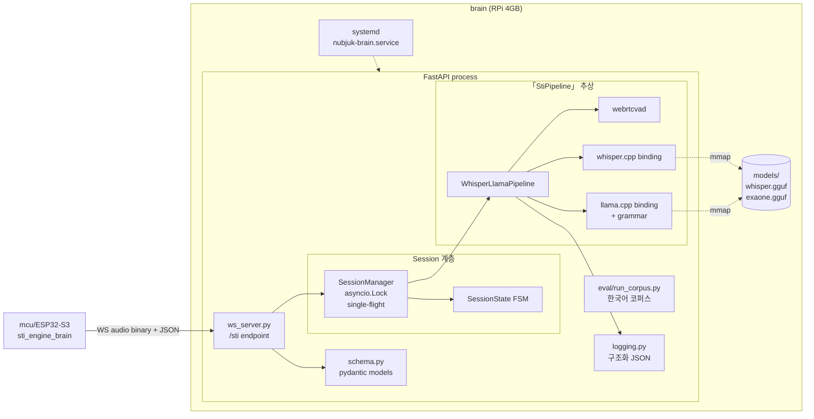
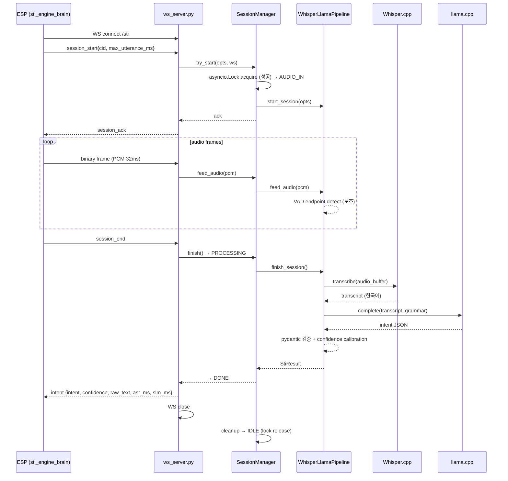
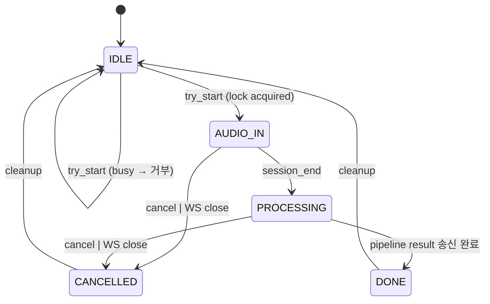

# Brain — 모듈 아키텍처

> ⚠️ **Phase 4부터 활성**. Phase 1~3에는 디렉토리만 존재.

RPi 4GB에서 stateful WS 세션으로 mcu의 `sti_engine_brain` 클라이언트와 통신하는 STI 서비스. ASR (Whisper.cpp) + SLM (EXAONE Q4) 파이프라인.

---

## 컴포넌트 다이어그램



---

## 한 utterance 처리 흐름



---

## SessionState 머신



**Cleanup 보장** (모든 종료 경로 — DONE/CANCELLED/예외):
1. lock release
2. pipeline `cancel_session()` 호출 (idempotent)
3. audio buffer 해제
4. subprocess가 살아있으면 terminate→kill (timeout 5초)

---

## Pipeline 구조 (WhisperLlamaPipeline)

```
audio frames (PCM 16kHz mono)
        │
        ▼
┌─────────────────────────────────┐
│  feed_audio(): buffer에 누적 +   │
│   webrtcvad endpoint 보조 신호    │
└─────────────────────────────────┘
        │
        │ session_end 도착
        ▼
┌─────────────────────────────────┐
│  Whisper.cpp transcribe          │  ASR (~800ms P50)
│   → 한국어 transcript            │
└─────────────────────────────────┘
        │
        ▼
┌─────────────────────────────────┐
│  llama.cpp (EXAONE 2.4B) +       │  SLM (~600ms P50)
│  GBNF grammar 강제                │
│   → JSON-valid intent            │
└─────────────────────────────────┘
        │
        ▼
┌─────────────────────────────────┐
│  pydantic 검증 + confidence       │  ~5ms
│  calibration (eval 기반 threshold)│
│   → StiResult or StiError       │
└─────────────────────────────────┘
```

---

## 메모리 배치

| 영역 | 위치 | 크기 | 비고 |
|------|------|------|------|
| Whisper.cpp 모델 (base.ko Q5) | mmap 파일 | ~200 MB | 페이지 캐시 |
| llama.cpp 모델 (EXAONE 2.4B Q4) | mmap 파일 | ~1.5 GB | 페이지 캐시 |
| Python 프로세스 (FastAPI + asyncio) | RAM | ~80 MB | |
| audio buffer (5초 max) | RAM | ~160 KB | session 시작 시 alloc |
| KV cache (추론 중) | RAM | ~500 MB peak | 단편화 주의 |
| **Steady-state (idle)** | | **≤ 2.0 GB** | |
| **Peak (active inference)** | | **≤ 2.8 GB** | |
| **헤드룸 (4GB - peak - kernel)** | | **≥ 500 MB** | |

---

## 외부 경계

```
┌──────────────────────────────────┐
│  brain (RPi 4GB)                 │
│                                  │
│  ws_server.py /sti               │
│         ▲                        │
│         │ WS audio + JSON        │
└─────────┼────────────────────────┘
          │
          │ docs/protocol/mcu-brain.md
          ▼
┌──────────────────────────────────┐
│  mcu/ESP32-S3                    │
│  sti_engine_brain (P4~)           │
└──────────────────────────────────┘
```

**잠금**: 통신 계약 변경은 사용자 승인 필수 + mcu의 `sti_engine_brain.c`와 동시 변경.

---

## Single-flight 동시성 모델

- FastAPI는 asyncio (단일 event loop)
- WS connection은 connection별 task로 처리
- `SessionManager.lock`이 전역 mutex 역할
- 두 번째 session_start는 lock acquire 실패 → 즉시 `session_busy` 응답 후 close

**Race 케이스 처리**:
- session_cancel과 session_end가 거의 동시 도착 → cancel 우선 (CANCELLED 진입 후 finish 무시)
- pipeline 실행 중 WS close → SessionManager가 disconnect 감지, cancel_session() 자동 호출
- pipeline subprocess hung → asyncio timeout으로 끊고 terminate→kill

---

## Latency 예산 (Phase 4 목표)

| 단계 | P50 | P95 |
|------|-----|-----|
| WS connect (LAN) | < 30 ms | < 80 ms |
| session_start → session_ack | < 20 ms | < 50 ms |
| audio upload (1초 발화) | < 200 ms | < 400 ms |
| Whisper transcribe (3초 오디오) | < 800 ms | < 1500 ms |
| SLM intent (≤ 200 토큰) | < 600 ms | < 1200 ms |
| pydantic 검증 + confidence | < 10 ms | < 30 ms |
| **Total (session_start → intent)** | **< 2.0 s** | **< 3.5 s** |

→ Rhino 단독 (~200 ms) 대비 ~10배 느리지만 자연어 자유도가 trade-off.

---

## Failure mode 매트릭스

| 시나리오 | 처리 |
|----------|------|
| ASR 빈 transcript | `error{code:"asr_failed"}`, recoverable |
| SLM timeout (>5s) | `error{code:"timeout"}`, terminate subprocess |
| Subprocess hung | terminate→kill (5s), `error{code:"internal"}` |
| OOM 임박 (>90%) | 새 session 거부 (`session_busy{reason:"resource_pressure"}`) |
| Half-open WS | SessionManager.cancel() 자동 호출 |
| 모델 init 실패 | systemd가 부팅 거부 + retry |
| Thermal throttle | 로그 경고, 정상 처리 시도 |
| Schema 위반 메시지 | `error{code:"schema_invalid"}`, recoverable (close X) |
| Concurrent session 시도 | `session_busy{reason:"single_flight"}`, close |

---

## Deployment 형태

```
RPi 4GB
├── /opt/nubjuk-brain/        (Python venv + 코드)
│   └── brain/...
├── /var/lib/nubjuk/models/   (gguf 파일, 외부 마운트 권장)
├── systemd: nubjuk-brain.service
│   ├── Restart=on-failure
│   ├── MemoryMax=3G
│   └── OOMScoreAdjust=-500
└── /var/log/nubjuk/brain.log (rotating)
```

Docker는 Phase 4 dev 환경에만 사용. 양산은 systemd 직접 실행 — 컨테이너 오버헤드와 thermal/cgroup 영향 회피.

---

## Phase별 활성

| Phase | 활성 |
|-------|------|
| 0~3 | 미존재 (디렉토리만) |
| 4 | WhisperLlamaPipeline + SessionManager + WS server |
| 5 | (변경 없음) Unity viewer는 brain과 무관 |
| 6 | + mTLS / 인증 / 24h soak / 모델 versioned rollback |
